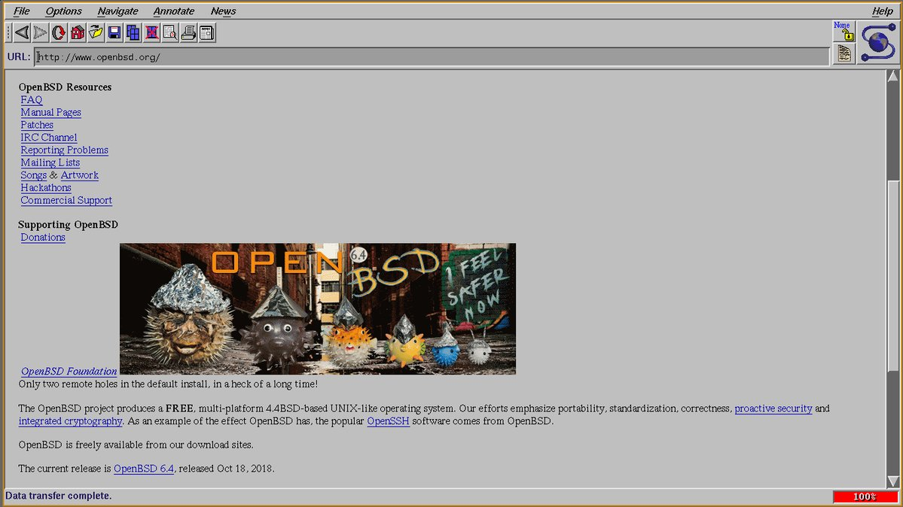

#### NCSA Mosaic 2.7 on OpenBSD

Added OpenBSD support and upgraded the archaic libpng code so you too can enjoy this historic web browser. NCSA's site causes a coredump, so run the binary with another URL as an argument. It's not great as a browser on the modern web, but it does make a great gopher client!

    $ git clone https://github.com/0x16h/ncsa-mosaic
    $ doas pkg_add motif
    $ cd ncsa-mosaic && make openbsd
    $ src/Mosaic gopher://gopher.club

