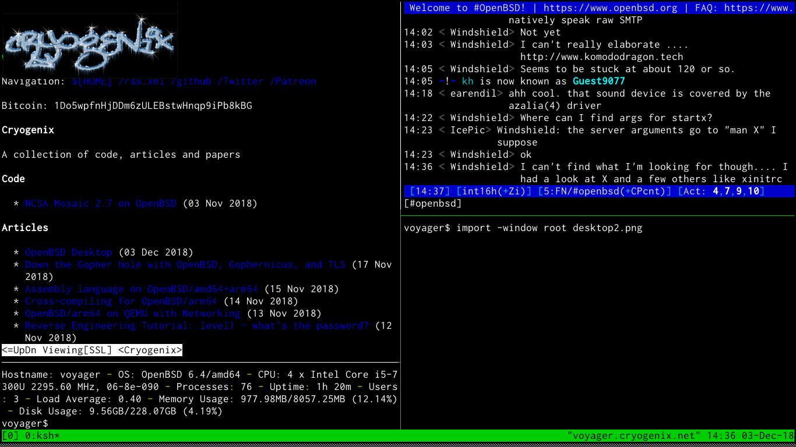

#### OpenBSD Desktop for Minimalists

Everyone loves an OpenBSD Desktop article, don't they? So there seems very little point in me reiterating what is a relatively simple process nowadays.  That said, after the install process there are a couple of things which, for me, make OpenBSD the perfect workstation operating system...

__TLDR: SCROLL DOWN__

OpenBSD has installed, and you've logged into the lovely xenodm(1) system and are presented with a classic-looking GUI - cwm(1).  I like cwm, in fact I would favour it if I was a big mouse user because it is such a simple, light and efficient solution to a 'problem' that has resulted in countless attempts to perfect a user-interface that ticks all the boxes... WIMP (Windows, Icons, Menus, Pointers) - as it was called in my pre-school* computing class.

In recent years, OpenBSD has become more popular as a desktop/workstation OS, which is quite surprising to many who consider it to be an arcane incarnation of BSD that's used only by tinfoil hatters, the BGP bourgeosie, and minimalist mashochists. Improved hardware support, the clean and ~perfect code style, a consistent environment, and the ease of configuration may be some reasons for people moving to the distro.

Personally, I used OpenBSD for years on bare-metal and VM servers as well as building a liveCD distro for occasional use before adopting it full-time.  Out of the box, it is faster and easier to configure than FreeBSD and even most linux distros.  I do still love FreeBSD, but it lacks *je ne sais quoi* that OpenBSD has at a base level which enables fast configuration and usability whatever you're using it on.

__TLDR: Start here__

I use a clean, minimalist system which maximises productivity without having a bloated userland; here's how to reproduce a basic version of it.

First, if you haven't done so already, add your user to doas.conf(5), make some performance tweaks to our filesystems in /etc/fstab(5) and grant us more memory (assuming you have at least 4GB) in login.conf(5) (from xterm in cwm):

    $ su root -c 'vi /etc/doas.conf'
    permit nopass keepenv yourusername
    $ doas sed -i 's/rw/rw,softdep,noatime/g' /etc/fstab
    $ doas sed -i 's/768M/2048M/g' /etc/login.conf 
    $ doas reboot

Install some packages from xterm in cwm:

    pkg_add ImageMagick \
    	bzip2 \
    	git \
    	gnupg \
    	iridium \
    	w3m \
    	mpv \
    	mupdf \
    	ratpoison \
    	rsync \
    	rxvt-unicode \
    	tor-browser \
    	rtorrent \
    	unzip

You would be surprised at how many packages in base can do the things you need... ftp(1) for example is not just an ftp client, but can be used like 'fetch' to download files over FTP, HTTP, and HTTPS.
 But there are a few packages I consider 'essential' listed above, some of which you may not know:

* Iridium is a secure build of Google's Chromium source, removing a lot of the spyware and crap left behind.  It also has some proactively secure features, such as password amnesia. Add the [Vimium](https://chrome.google.com/webstore/detail/vimium/dbepggeogbaibhgnhhndojpepiihcmeb) extension for decent keyboard-controlled browsing (ProTip: alt-F to start).
* mupdf is a simple PDF viewer - but more featureful than xpdf. There is also poppler-utils if you want pdftohtml or pdftotext (and of course poppler itself which is a fork of xpdf).
* mpv is a media player based on mplayer
* ratpoison is my window-manager of choice. Written in C with tiling. No mouse required (hence the name).

I used to start X from the console, but following a woopsie involving Xorg being setuid, OpenBSD revoked that privilege and now users should use xenodm(1) to start X and their window manager. Let's create our ratpoison session in ~/.xsession:

    xset b off
    xrdb -merge ~/.Xresources
    eval $(ssh-agent)
    /usr/local/bin/ratpoison

* The first command stops that awful beeping. As sensitive creatures who sit up late hacking away at something, it's too much.
* The second merges .Xresources with our current X resources.
* The third starts ssh-agent, quite useful if you want to add or use ssh keys.
* Finally, we execute our window manager - ratpoison!

A basic ~/.ratpoisonrc:

    startup_message off
    escape Super_L
    bind i exec iridium
    bind t exec tor-browser
    bind r exec urxvt +sb -e rtorrent
    bind x exec urxvt +sb -fn "xft:Inconsolata:pixelsize=16"
    exec /usr/local/bin/rpws init 6 -k
    exec urxvt +sb -fn "xft:Inconsolata:pixelsize=16"

* Stop telling us about the help shortcut
* Use the Windows/Meta/Left-Super key instead of C-t
* Bind keys to applications
* Create 6 virtual desktops/workstations
* Start urxvt when ratpoison starts

As much as I like the retro/SunOS look of rxvt with a white background, I like to tweak the look slightly in ~/.Xdefaults:

    URxvt.loginShell: true
    URxvt.scrollBar: false
    URxvt.cursorBlink: true
    URxvt.foreground: #FFFFFF
    URxvt.background: #000000
    *visualBell: True

*visualBell flashes the screen since we have the audible bell disabled. Perhaps not a great idea if you have certain forms of epilepsy; Keep pressing backspace for more info.

Press Ctrl-Alt-Backspace to restart X and return to Xenodm, then login again.

You should now be presented with a lovely urxvt terminal with a black background. Here are some keyboard shortcuts to help you get started:

* ALT+F1-F6 - Change to desktop/workstation 1-6
* WIN x - start urxvt
* WIN i - start iridium browser
* WIN t - start Tor browser
* WIN r - start rtorrent 
* WIN ! - execute command
* WIN SHIFT+K - kill current window
* WIN ? - show all keyboard shortcuts

As for tmux(1) which is included in base and a window manager (albeit for shells) in its own right, CTRL-b :split-window -h, :split-window, and the arrow keys are your friends.

Have fun! 
